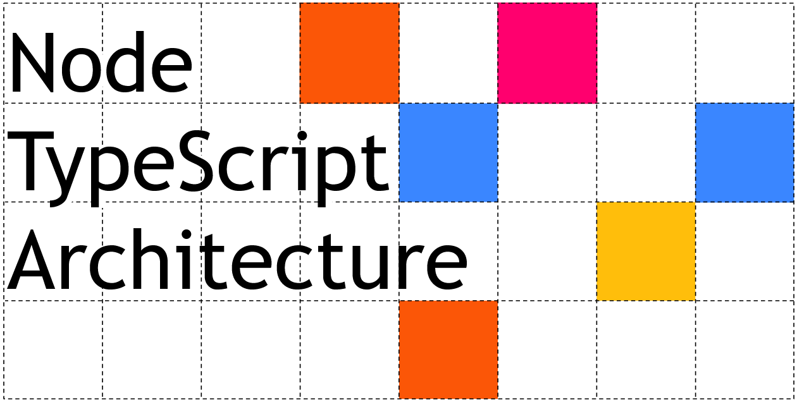

# Node TypeScript Architecture

(Work in progress, come back soon!)

This project describes and demonstrates an opinionated architecture for writing Node.js applications, particularly those written
in TypeScript.

"Architecture", here, means the way a program is structured to support long term development, and the decisions that are
often hardest to change without a complete rewrite.

This architecture can be used for backend apps, CLI programs, REST APIs, GraphQL boxes or even as part of an SPA. It can
support concerns like logging, event emitting and database transactions, and it will work with non-TypeScript projects too.

### What kind of architecture?

NTA is loosely based on an 'onion architecture' pattern (sometimes called the 'clean architecture' or 'ports and adapters'),
decoupling core business logic from database / storage concerns by means of dependency injection. But don't worry if you've never used DI or have
bad experiences with IOC frameworks, though - NTA uses no frameworks or magical DI containers, just some simple functional programming
techniques.

(And if you aren't familiar with functional programming in JavaScript, I'll talk you through that, too)

## What's in this repo?

As well as the documentation, this codebase comprises a 'library' containing business logic and several 'adapters' and
'bindings' for different dependencies like databases and HTTP frameworks, combined into two applications - showing how this
architecture lets you mix and match various components:

1. A 'webapp' that combines a Postgres database (with transactions), RabbitMQ events (for e.g. a microservice architecture), and an Express server
2. A 'cli' that combines a Vorpal.js CLI frontend with an in-memory database

The codebase is commented and the impatient reader is welcome to dive right into the code, starting with 
the `src/app` folders - but if you have time, start with the documentation.

## The example application

This project implements a simple 'community library' system. Users and books can be registered, and users can check out
and return books at their leisure. Users can be removed from the system, but only if they have no outstanding loans. To
keep things simple, I've left out things like dealines and paying fines.

The aim is to build an app that is small enough to be easily digested, but bigger than a simple 'todo' app that might leave
too many questions unanswered.

The project includes two apps you can spin up yourself - see the documentation for a how-to.

## NOTES FOR USERS

Connect 0.0.0.0 -p 5432 user=username pw=password database=db
